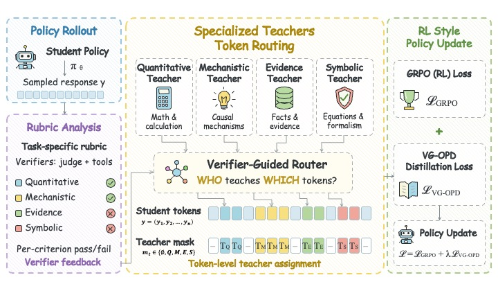

<div align="center">

# VG-OPD

### Verifier-Gated Multi-Expert On-Policy Distillation for Scientific Reasoning

[](https://www.python.org/)
[](https://pytorch.org/)
[](https://github.com/vllm-project/vllm)
[](https://github.com/SeanXunX/verl)
[](https://arxiv.org/abs/2609.15404)
[](https://huggingface.co/seanxunx/vgopd)
[](LICENSE)

*Teach a student only the tokens a verifiably better expert disagrees with.*

</div>

---

VG-OPD trains a scientific-reasoning student with GRPO while distilling, **token by token**, from a pool of
capability-specific expert teachers. Every training question carries a small rubric of machine-checkable
*criteria* (final answer, intermediate quantities, mechanistic explanations, evidence use). When a student
rollout fails a criterion, the matching expert is **probed**; its answer is admitted as a teacher only if a
verifier confirms it actually satisfies the criterion the student missed (the **gate**). Admitted teachers are
**routed per criterion**, their per-token log-probabilities are fetched through a LoRA sidecar, and the
distillation signal is **localized** to the tokens where the teacher disagrees with the student. The resulting
weighted KL term is fused with the GRPO objective.

## Overview



## Installation

Requirements: Linux, CUDA 12.x drivers, Python 3.11, [uv](https://github.com/astral-sh/uv), and GPUs with at least 40 GB
of memory for the 4B recipes (the 8B recipes were run on 5 x 40 GB for training plus 2 x 40 GB for the judge).

```bash
git clone <this repository> vgopd && cd vgopd
cp .env.example .env                      # fill in WANDB_API_KEY if you want wandb logging
bash scripts/setup/install_verl.sh        # clones verl @ 7aed6b23, applies third_party/verl-vgopd.patch, runs uv sync
```

The patch touches seven verl files (+225 / -21 lines) and is entirely env-gated: with `CROPD_VGOPD_HOOK`,
`CROPD_CRIPO` and `CROPD_DISTILL_EXT` unset, the patched verl behaves exactly like upstream.

The judge runs in its own environment so that it can use a newer vLLM than the training stack:

```bash
cd serve && uv sync && cd ..
```

Model weights are looked up under `CROPD_MODELS` (default `models/`). Place or symlink the base model there,
for example `models/Qwen3-4B` or `models/Qwen3-8B`.

## Services: judge and expert sidecar

Training and evaluation talk to two OpenAI-compatible endpoints.

| Service | Purpose | Default | Launcher |
|---|---|---|---|
| Judge | Scores `llm_judge` criteria, annotates and gates criteria, gates open-ended rubrics | `http://localhost:8000/v1`, model name `judge` | `MODEL=<judge model> TP=2 CUDA_VISIBLE_DEVICES=0,1 bash serve/launch_judge.sh` |
| Sidecar | Serves the base model plus the four expert LoRA adapters; answers gate probes and returns teacher log-probs | `http://localhost:8001/v1`, base model name `repair`, adapters `quant`, `symbolic`, `mech`, `evidence` | `GPU=5 BASE=models/Qwen3-4B EXPERT_PREFIX=models/expert bash serve/run_sidecar.sh` |

The sidecar expects `${EXPERT_PREFIX}-{quant,symbolic,mech,evidence}/lora_adapter/` and restarts itself if vLLM
crashes. A 35B-class instruction model served with FP8 weights on two 40 GB GPUs was used as the judge.

## Data pipeline

The scripts in `scripts/data/` rebuild every dataset from the raw sources. Each script covers one stage and exposes
its steps as subcommands (`--help` lists them); outputs go to `data/processed/` and `data/splits/` (ignored by git)
and every split uses a fixed seed. Run the stages in the order below, from the repository root with
`.venv/bin/python`. The judge must be online for `criteria.py annotate`, `open_rubrics.py gate` and
`benchmarks.py gate-rar`; everything else is CPU only.

| Stage | Command | Produces |
|---|---|---|
| Verifiable pool (physics, chemistry) | `pool.py stage`, `build`, `split`, `contam` | Dr.SCI snapshot with checksums, deduplicated pool, stratified splits, GPQA-Diamond contamination quarantine |
| Criteria | `criteria.py annotate`, `gate`, `export` | judge-written criteria, the bank re-verified on the reference answers, verl parquet files with per-axis expert slices (`verl_v1/`) |
| Open-ended rubrics (mechanistic, evidence) | `open_rubrics.py gate`, `export` | judge-gated rubric items with axis labels, open-ended criteria bank and verl files (`verl_open_v1/`) |
| Student mix | `student_mix.py` | axis-balanced training mix plus the merged internal dev set (`verl_merge_v1/`) |
| External benchmarks | `benchmarks.py stage`, `rows`, `gate-rar`, `mix` | normalized benchmark tables (`bench_v1/`); `rows`, `gate-rar` and `mix` build the benchmark-augmented mix used for the released 8B model (`verl_8b_v1/`) |

<details>
<summary><b>Expected raw benchmark files</b> under <code>data/raw/bench_v1/</code> (click to expand)</summary>

| Benchmark | Location | Scoring |
|---|---|---|
| GPQA-Diamond | `gpqa/gpqa_diamond.csv` | multiple choice |
| MMLU-Pro | `mmlu_pro/data/test-*.parquet` (+ `validation-*.parquet` for training rows) | multiple choice |
| MATH-500 | `math500/test.jsonl` | math equivalence |
| SciBench | `scibench/*.json` | numeric with unit |
| ChemBench | `chembench/*.parquet` | multiple choice / numeric |
| RaR-Science | `rar_science/data/{train,val,test}-*.parquet` | rubric (judge) |
| RaR-Medicine | `rar_med/test.parquet` | rubric (judge) |
| AIME 2026 | `aime26/aime_2026.parquet` | integer answer |

</details>

## Training

All launchers read `.env`, take hyper-parameters from environment variables and pass any extra arguments through
to verl's Hydra configuration. `scripts/examples/` contains the exact recipes used for the paper as templates.

### 1. Expert teachers

One LoRA expert (rank 64, all linear layers) per capability axis, trained with GRPO on the axis slice:

```bash
GPUS=0,1,2,3 NGPU=4 BASE=models/Qwen3-4B bash scripts/examples/run_experts.sh
```

| Axis | Launcher | Data | Reward | Recipe |
|---|---|---|---|---|
| `quant`, `symbolic` | `scripts/train/train_expert.sh` | `verl_v1/train_<axis>.parquet` | rule / numeric / sympy verifiers, no judge | batch 60, 8 rollouts, lr 5e-6, KL 1e-3 (low-variance), entropy 0 |
| `mech`, `evidence` | `scripts/train/train_expert_open.sh` | `verl_open_v1/train_<axis>.parquet` | `llm_judge` criteria (judge must be online) | batch 60, 6 rollouts, lr 1e-5, entropy 0 |

Checkpoints are saved every 25 steps. Teachers are selected **offline with greedy decoding** on the internal dev
set (sampled in-training validation is not a reliable proxy for teaching quality):

```bash
bash scripts/examples/fold_checkpoint.sh expert-quant 150                 # merge FSDP shards, fold LoRA, keep lora_adapter/
CUDA_VISIBLE_DEVICES=4 .venv/bin/python scripts/eval/vet_expert.py --axis quant --cands models/expert-quant-s{100,150,200}
```

`vet_expert.py` evaluates each candidate, prints the axis score against the base model and symlinks the winner
to `models/expert-<axis>`, which is the layout `serve/run_sidecar.sh` expects.

### 2. Student

`scripts/train/train_student.sh` runs GRPO with the VG-OPD hook enabled; the arm is selected through environment
switches and Hydra overrides. `scripts/examples/run_student_arms.sh` wires them up:

```bash
ARMS="vgopd grpo" GPUS=2,3,4 NGPU=3 BASE=models/Qwen3-4B bash scripts/examples/run_student_arms.sh
```

| Arm | Objective | Key switches |
|---|---|---|
| `vgopd` | GRPO + 0.25 x VG-OPD (the proposed method) | `CROPD_HOOK_MODE=vgopd USE_TASK_REWARDS=True USE_PG=True`, `distillation_loss_coef=0.25` |
| `grpo` | GRPO only | `distillation.enabled=False`, `CROPD_PROBE_SKIP_SCORE=-1`, entropy 0 |
| `grpo_opsd` | GRPO + 0.25 x OPSD (privileged self-distillation from the base model with the rubric in context) | `CROPD_HOOK_MODE=opsd` |
| `grpo_mopd` | GRPO + 0.25 x MOPD (domain-routed multi-expert OPD, uniform weights, no gate) | `CROPD_HOOK_MODE=mopd` |
| `cripo` | CriPO-S (suppressed-criteria advantage flipping) | `CROPD_CRIPO=1`, `distillation.enabled=False`, `MAXLEN=8192` |
| `vgopd_pure`, `opsd_pure`, `mopd_pure` | Standalone distillation without task rewards | `USE_TASK_REWARDS=False USE_PG=True`, `distillation_loss_coef=1.0`, lr 5e-6, entropy 0.005 |

Shared student recipe: LoRA rank 64, 8 rollouts per prompt, lr 1e-5, reference-KL 1e-3 (low-variance
estimator), entropy 0.01, response length 4096, thinking disabled, validation every 25 steps with 4 samples per
prompt. The 4B runs use batch 21 on 3 GPUs; the released 8B model uses batch 20 on 5 GPUs
(`BATCH=20 GPUS=2,3,4,6,7 NGPU=5 UTIL=0.70 BASE=models/Qwen3-8B TRAIN=data/processed/verl_8b_v1/train.parquet`).

Ablations are single environment switches on the `vgopd` arm:

| Ablation | Switch |
|---|---|
| No gate (teach every failed criterion) | `CROPD_GATE=0` |
| Domain routing / random routing instead of per-criterion routing | `CROPD_ROUTE_MODE=domain` / `random` |
| Dense (whole-sequence) weights / random token mask / step-level mask | `CROPD_ATTR_MODE=full` / `random` / `step` |
| Uniform criterion weights | `CROPD_UNIFORM_W=1` |
| Single primary teacher per rollout | `CROPD_MULTI_TEACHER=0` |
| Teacher conditioned on the violated criteria | `CROPD_TEACHER_RUBRIC=1` |
| Top-K distribution distillation instead of sampled log-probs | `TOPK=128` (sets `forward_kl_topk`, `CROPD_TEACHER_TOPK`, `CROPD_W_AT_AGG`) |

Set `CROPD_TRACE_DIR=outputs/trace/<exp>` to record per-rollout routing, gate and mask statistics;
`scripts/analysis/trace_stats.py <exp>` summarizes them (routing matrix, gate acceptance per expert, weight
sparsity, position density).

### 3. Folding a checkpoint into a deployable model

```bash
BASE=models/Qwen3-8B bash scripts/examples/fold_checkpoint.sh 8b-student-vgopd 275
```

This merges the FSDP shards with `verl.model_merger`, folds the LoRA adapter into the base weights with
`scripts/train/fold_lora.py` and keeps the adapter next to the folded model.

## Evaluation

Protocol used throughout: greedy decoding, thinking disabled, up to 4096 new tokens.

```bash
MODELS="student-vgopd-s275 student-grpo-s300" GPU=2 bash scripts/examples/run_eval.sh
```

| Tool | What it measures |
|---|---|
| `scripts/eval/eval_matrix.py --name N --model DIR [--closed-only] [--split test]` | Internal dev matrix: criteria reward per capability axis on the held-out dev pools (judge required unless `--closed-only`) |
| `scripts/eval/eval_bench.py --name N --model DIR --bench gpqa_diamond,math500,... [--subsample K]` | External benchmarks; generations are cached per model so re-scoring is free |
| `scripts/eval/bench_table.py` | Markdown table over all evaluated models |
| `scripts/eval/table_8b.py [--pick]` | Grouped table (scientific / domain / general reasoning) for the 8B arms |

Judge-scored benchmarks (RaR-Science, RaR-Medicine, internal dev) should run one at a time against a single judge;
rule-scored benchmarks can run in parallel on separate GPUs.

## Configuration reference

<details>
<summary><b>Environment variables read by the library</b> (click to expand)</summary>

| Variable | Default | Meaning |
|---|---|---|
| `CROPD_VGOPD_HOOK` | unset | `1` activates the agent-loop hook and the sidecar-as-teacher mode of the verl patch (set by `train_student.sh`) |
| `CROPD_DISTILL_EXT` | unset | Module imported into verl's distillation registry (`cropd.verl_ext.losses`) |
| `CROPD_HOOK_MODE` | `vgopd` | `vgopd`, `mopd` or `opsd` |
| `CROPD_GATE` | `1` | `0` disables the Delta' gate |
| `CROPD_ROUTE_MODE` | `criterion` | `criterion`, `domain` or `random` |
| `CROPD_ATTR_MODE` | `disagree` | `disagree`, `full`, `random` or `step` |
| `CROPD_DISAGREE_Q` | `0.10` | Quantile of lowest teacher log-probabilities selected as disagreement tokens |
| `CROPD_ATTR_REPAIR` | `1` (launcher sets `0`) | Use a repair attempt by the teacher for step-level attribution |
| `CROPD_UNIFORM_W` | `0` | `1` ignores criterion weights |
| `CROPD_MULTI_TEACHER` | `1` | `0` keeps only the primary teacher per rollout |
| `CROPD_TEACHER_RUBRIC` | `0` | `1` shows the teacher the violated criteria |
| `CROPD_PROBE_SKIP_SCORE` | `1.01` (launcher sets `0.75`) | Rollouts with reward at or above this value are not probed; `-1` disables distillation entirely |
| `CROPD_PROBE_MAX_TOKENS` | `3072` | Generation budget for gate probes and repairs |
| `CROPD_TEACHER_TOPK` | `0` | `>0` fetches top-K teacher distributions (with `forward_kl_topk`) |
| `CROPD_W_AT_AGG` | unset | Apply `distill_weights` at loss aggregation (top-K mode) |
| `CROPD_TOPK_CHUNK` | `0` | Chunked, checkpointed top-K loss to fit 40 GB cards |
| `CROPD_VGOPD_INNER_KL` | `k3` | Inner KL estimator of `vgopd_weighted` |
| `CROPD_OMEGA_GAMMA` | `0.5` | Exponent of the criterion-weight compression |
| `CROPD_MOPD_W`, `CROPD_OPSD_W` | `1.0` | Uniform token weight of the MOPD / OPSD baselines |
| `CROPD_OPSD_TEACHER` | `repair` | Sidecar model name used as the OPSD teacher |
| `CROPD_CRIPO` | unset | `1` enables the CriPO-S baseline in the patch |
| `CROPD_CRIPO_ALPHA`, `CROPD_CRIPO_TAU`, `CROPD_CRIPO_K` | `0.1`, `0.1`, `3` | CriPO-S hyper-parameters |
| `CROPD_TRACE_DIR`, `CROPD_TRACE_EVERY` | unset, `10` | Trace directory and sampling rate |
| `CROPD_HOOK_DEBUG` | unset | Print per-sample hook decisions |
| `CROPD_JUDGE_BASE_URL`, `CROPD_JUDGE_MODEL`, `CROPD_JUDGE_API_KEY` | `http://localhost:8000/v1`, `judge`, `EMPTY` | Judge endpoint |
| `CROPD_JUDGE_TIMEOUT`, `CROPD_REWARD_TIME_BUDGET` | `20`, `12` (launchers set `60`, `30`) | Judge call timeout and total reward time budget per sample, seconds |
| `CROPD_JUDGE_CACHE` | `data/cache/llm_judge` | On-disk cache of judge verdicts |
| `CROPD_REPAIR_BASE_URL`, `CROPD_REPAIR_TIMEOUT` | `http://localhost:8001/v1`, `120` | Sidecar endpoint |
| `CROPD_EVAL_NOTHINK`, `CROPD_BENCH_NOTHINK`, `CROPD_EVAL_MAX_TOKENS` | unset, unset, `3072` | Evaluation decoding switches |
| `CROPD_FOLD_BASE` | `$CROPD_MODELS/Qwen3-4B` | Base weights used by `fold_lora.py` |
| `CROPD_MODELS`, `PROJECT`, `WANDB_API_KEY` | `models`, `vgopd`, unset | Model root, wandb project, wandb key (wandb logging is enabled only when the key is set) |

</details>

<details>
<summary><b>Launcher variables</b> (click to expand)</summary>

`MODEL_PATH`, `EXP`, `STEPS`, `GPUS`, `NGPU`, `UTIL` (vLLM memory fraction), `RESP` (response length), `MAXLEN`
(rollout context), `PPO_TOK` (tokens per GPU in the actor update), `BATCH`, `TEST_FREQ`, `VAL_N`, `VAL_SAMPLE`,
`USE_TASK_REWARDS`, `USE_PG`, `TOPK`, `LOSS_MODE`, `SMOKE` (two-step smoke test), `AXIS` (experts only). Any
additional command-line arguments are forwarded to `verl.trainer.main_ppo` as Hydra overrides.

</details>

## License

The code in this repository is released under the [Apache License 2.0](LICENSE).

## Citation

```bibtex
@misc{xu2026teachestokenverifiergatedmultiexpert,
      title={Who Teaches Which Token? Verifier-Gated Multi-Expert On-Policy Distillation for Scientific Reasoning}, 
      author={Xun Xu and Zaixi Zhang},
      year={2026},
      eprint={2609.15404},
      archivePrefix={arXiv},
      primaryClass={cs.AI},
      url={https://arxiv.org/abs/2609.15404}, 
}
```

## Acknowledgements

Built on [verl](https://github.com/verl-project/verl), [vLLM](https://github.com/vllm-project/vllm),
[PEFT](https://github.com/huggingface/peft) and the [Qwen3](https://github.com/QwenLM/Qwen3) models.
